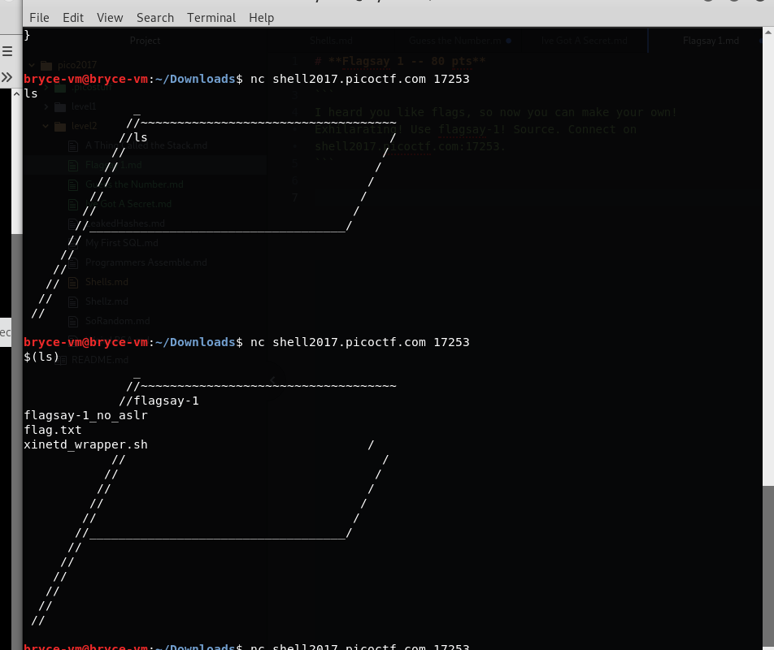

# **Flagsay 1 -- 80 pts**

```
I heard you like flags, so now you can make your own! Exhilarating! Use flagsay-1! Source. Connect on shell2017.picoctf.com:17253.
```

This is a very easy one, just look at the source code!

`char commandBase[] = "/bin/echo \"%s\"\n";`

The string input is put into the terminal.



Bingo


flag{d566d79fd4cbcacb0fb10dca6c97d148}
