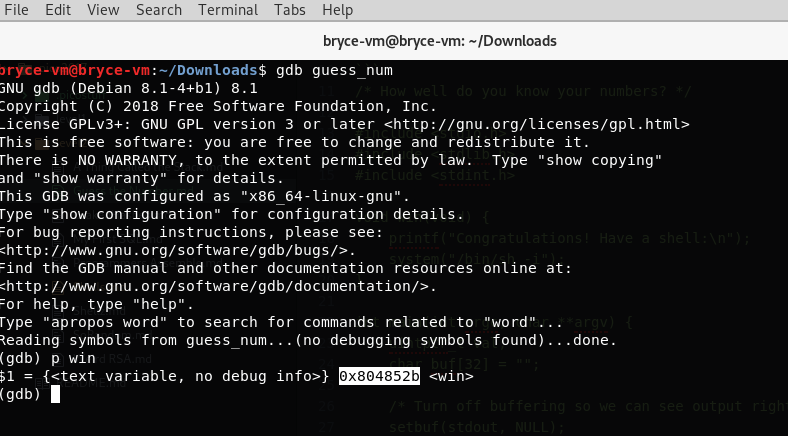

# **Guess the Number - 75 pts**

```
Just a simple number-guessing game. How hard could it be? Binary Source. Connect on shell2017.picoctf.com:49258.
```

If you're given a source, it's probably a good idea to look at it...

### guess_num
```
/* How well do you know your numbers? */

#include <stdio.h>
#include <stdlib.h>
#include <stdint.h>

void win(void) {
    printf("Congratulations! Have a shell:\n");
    system("/bin/sh -i");
}

int main(int argc, char **argv) {
    uintptr_t val;
    char buf[32] = "";

    /* Turn off buffering so we can see output right away */
    setbuf(stdout, NULL);

    printf("Welcome to the number guessing game!\n");
    printf("I'm thinking of a number. Can you guess it?\n");
    printf("Guess right and you get a shell!\n");

    printf("Enter your number: ");
    scanf("%32s", buf);
    val = strtol(buf, NULL, 10);

    printf("You entered %d. Let's see if it was right...\n", val);

    val >>= 4;
    ((void (*)(void))val)();
}
```

We want to call `win()` somehow, so let's go ahead and get the address. GDB is a great tool for looking at binaries.



`win()` is located at `0x804852b`. How can we call this address?

### **Let's follow the user input**
So we need `uintptr_t val` to be = `0x804852b` by the end.

Binary = `0b1000000001001000010100101011`
Shift by 4 = `0b10000000010010000101001010110000`

This gives us `2152223408`, but when we input that we get a segmentation fault... why?

This value is out of *numeric range* of `strtol`, so what can we do...?

### "strtol checks for overflow, but it does allow negative numbers..."

So how can we use negative numbers? We need to take the two's complement of the binary, which is `-2142743888`

Let's try it out!


flag{f2892be47d731c96e753d14c913fd757}
