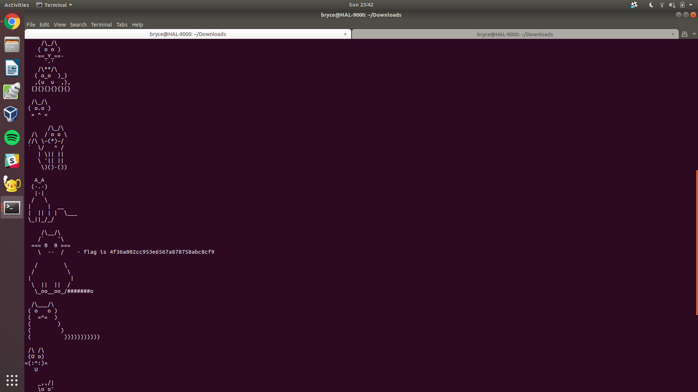

# **LeakedHashes - 90 pts**

```
Someone got hacked! Check out some service's password hashes that were leaked at hashdump.txt! Do you think they chose strong passwords? We should check... The service is running at shell2017.picoctf.com:3815!
```

So we're given a text file full of hashes and the corresponding usernames to thsoe hashes... what's next?


### **Step 1 - see if the hashes have been cracked before**
Cracking hashes yourself is one thing, might as well see if the others have been cracked before. I used [md5](https://hashkiller.co.uk/md5-decrypter.aspx) for this.

Although from this, you will not get root's password, might as well try to login to one of the other users, and try to find extra information.

### **Step 2 - login to service using nc**
And login with one of the users. I used "christene". You'll be given a prompt, which you should reply yes, and find the flag hiding in some wonderful ASCII art.



Nice!


flag{4f36a002cc953e6567a878758abc8cf9}
