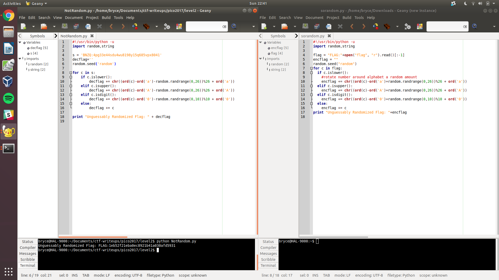

# **SoRandom - 75 pts**

```
We found sorandom.py running at shell2017.picoctf.com:19789. It seems to be outputting the flag but randomizing all the characters first. Is there anyway to get back the original flag?

Update (text only) 16:16 EST 1 Apr Running python 2 (same version as on the server)
```

So we're given a "randomized" flag and a python script that derived this output. How can we "unrandomize" the output to find the input?


### **Step 1 - create Python script which reverses the randomization**
This can be done easily by looking at 'sorandom.py'



Here's an example script I made, NotRandom.py, which is almost completely like sorandom.py, but it does the opposite function in the randomizing while loop.


flag{1eb52f21eba0ec8921b41a030afd5931}
