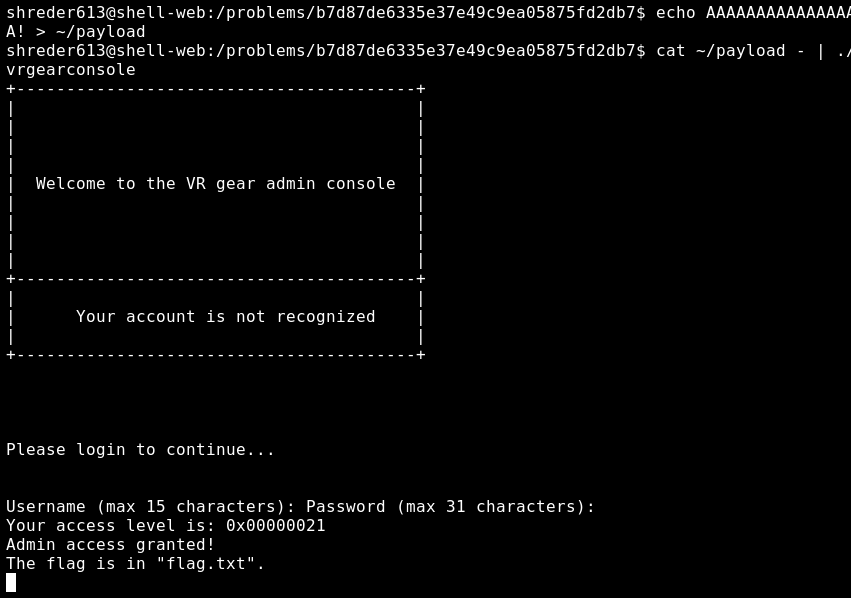

# **VR Gear Console - 90 pts**

```
Here's the VR gear admin console. See if you can figure 
out a way to log in. The problem is found here: 
/problems/b7d87de6335e37e49c9ea05875fd2db7
```

Change into the directory, and let's try to look at what's going on Here

### vrgearconsole.c

```
#include <stdlib.h>                                                                  
#include <stdio.h>                                                                   

int login() {                                                                        
    int accessLevel = 0xff;                                                          
    char username[16];                                                               
    char password[32];                                                               
    printf("Username (max 15 characters): ");                                        
    gets(username);                                                                  
    printf("Password (max 31 characters): ");                                        
    gets(password);                                                                  

    if (!strcmp(username, "admin") && !strcmp(password, "{{ create_long_password() }}
")) {                                                                                
        accessLevel = 2;                                                             
    } else if (!strcmp(username, "root") && !strcmp(password, "{{ create_long_passwor
d() }}")) {                                                                          
        accessLevel = 0;                                                             
    } else if (!strcmp(username, "artist") && !strcmp(password, "my-password-is-secre
t")) {                                                                               
        accessLevel = 0x80;                                                          
    }                                                                                

    return accessLevel;                                                              
}                                                                                    

int main(int argc, char **argv) {                                                    
    setbuf(stdout, NULL);                                                            
    printf(                                                                          
        "+----------------------------------------+\n"                               
        "|                                        |\n"                               
        "|                                        |\n"                               
        "|                                        |\n"                               
        "|                                        |\n"                               
        "|  Welcome to the VR gear admin console  |\n"                               
        "|                                        |\n"                               
        "|                                        |\n"                               
        "|                                        |\n"                               
        "|                                        |\n"                               
        "+----------------------------------------+\n"                               
        "|                                        |\n"                               
        "|      Your account is not recognized    |\n"                               
        "|                                        |\n"                               
        "+----------------------------------------+\n"                               
        "\n\n\n\n"                                                                   
        "Please login to continue...\n\n\n"                                          
    );                                                                               
    int access = login();                                                            

    printf("Your access level is: 0x%08x\n", access);                                

    if (access >= 0xff || access <= 0) {                                             
        printf("Login unsuccessful.\n");                                             
        exit(10);                                                                    
    } else if (access < 0x30) {                                                      
        printf("Admin access granted!\n");                                           
        printf("The flag is in \"flag.txt\".\n");                                    
        system("/bin/sh");                                                           
    } else {                                                                         
        printf("Login successful.\n");                                               
        printf("You do not have permission to access this resource.\n");             
        exit(1);                                                                     
    }                                                                                
}                                                            
```

So when you login, you get an "authentication level". This is what we will need to manipulate in order to get admin access and the flag.

Let's look at the hints:
`What happens if you read in more characters than the length of the username buffer?`

Looking at user and password, we can see that the username is actually 16 characters, and the password is 32. So, let's take that into account when generating a payload. We need the buffers to overflow into the accessLevel parameter, so accessLevel < 0x30.



Success!


flag{8989d0261ee17bbf95ea5596711538b0}
