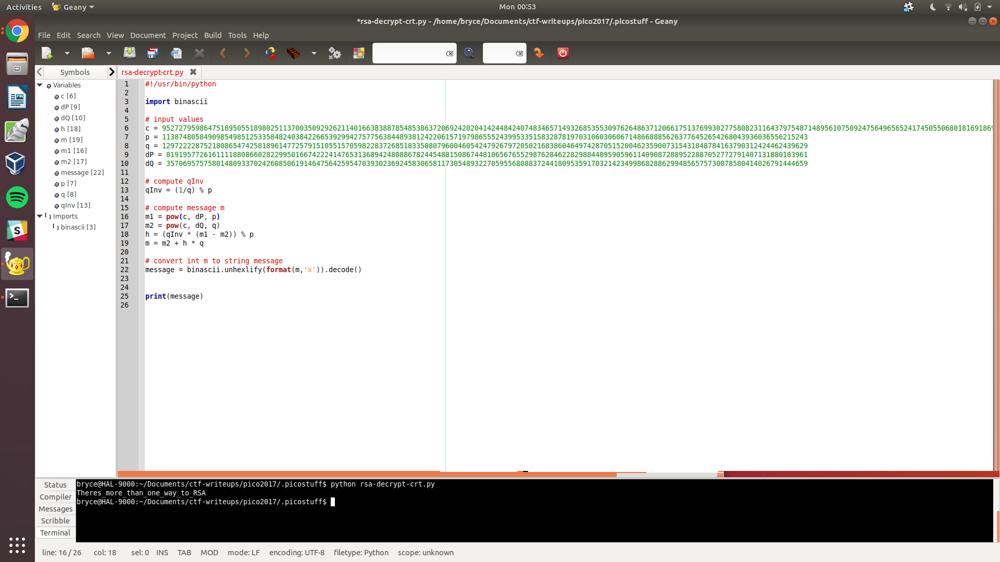

# **Weird RSA - 90 pts**

```
We recovered some data. It was labeled as RSA, but what in the world 
are "dq" and "dp"? Can you decrypt the ciphertext for us?
```

A lot of this involves just googling. Let's get on with it.

### **Step 1 - research Chinese Remainder Theorem and RSA**
[This](https://www.di-mgt.com.au/crt_rsa.html) is a good resource that I used, which explains CRT and how it relates to the RSA algorithm (with steps).

With this knowledge, and the values in the textfile, we can begin working.

### **Step 2 - create a script that performs the calculations**
I used Python, you can see this sample code for reference.



And hey, if you do it all right, the flag outputs, nice and clean. Check.


flag{Theres_more_than_one_way_to_RSA}
